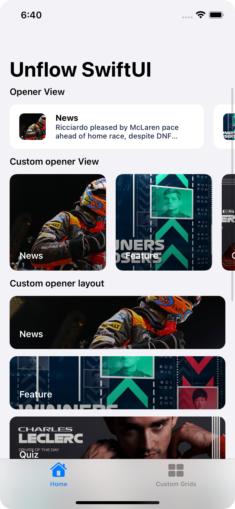
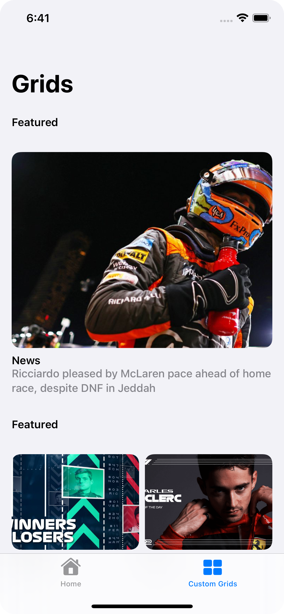
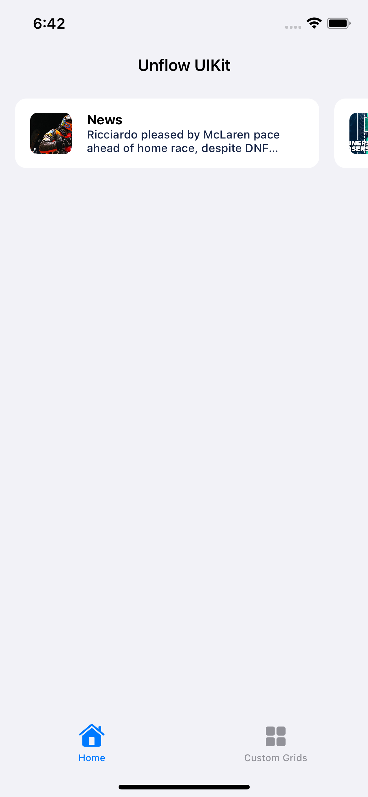
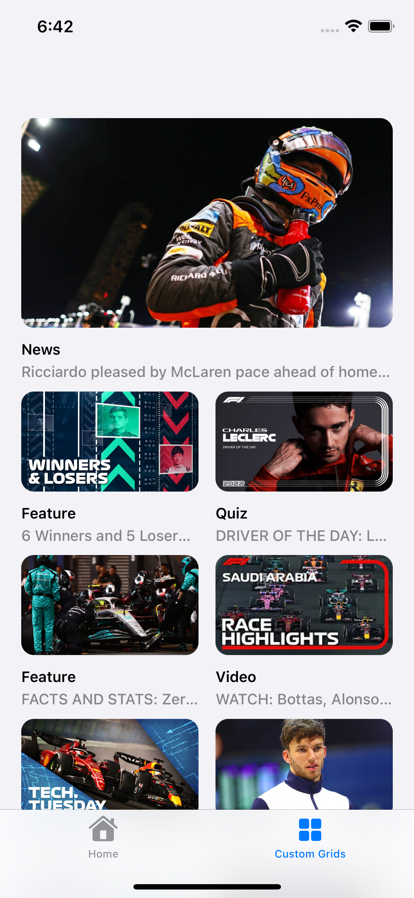

# Unflow iOS SDK

Tired of building the same simple screens over and over again? Empower your product team to create and ship content using the Unflow mobile SDK.

## Docs

Please visit [docs.unflow.com](https://docs.unflow.com/) for Quick Start and detailed explanations of features, usage, and more info.

## Installation


The reccomended way to install the package is via Swift Package Manager. You can add it via Xcode as a package dependency.

> https://github.com/unflowhq/unflow-ios-sdk 

If you're using packages, you can declare it as follows.

```
dependencies: [
  .package(url: "https://github.com/unflowhq/unflow-ios-sdk", from: "1.15.1") // Grab the current version
]
```

You can also use Cocoapods.

```ruby
pod 'Unflow', '~> 1.15.1' // Grab the current version
```

## Compatibility

### iOS
The framework is installable on iOS 11, but most functionality is locked to iOS 13 only ( we use SwiftUI heavily ). If you're installing on an app that supports lower than iOS 13, you'll need some `#available` checks. 

### Xcode
The Unflow iOS SDK requires Xcode 14. A backwards compatible version is shipped with the `-swift-5.6` suffix, which will run on Xcode 13. When the AppStore stops accepting uploads from Xcode 13, we'll stop supporting this version.

## Samples

We've built some small sample apps to help you get started. You'll need to provide your own API key, but they should give you the examples you need to get started.

| Sample | Openers | Custom Openers |
| - | - | - |
| SwiftUI Swift Package Manager | |  |
| UIKit Cocoapods |  |  |

## Demo App

Our app, Unflow Mirror, is available on the App Store to try for free. You can download it, play around with our sample content, then if you decide to subscribe to Unflow, you'll be able to scan a QR code and see your own content.

[AppStore](https://apps.apple.com/app/unflow-mirror/id1604415578?platform=iphone)